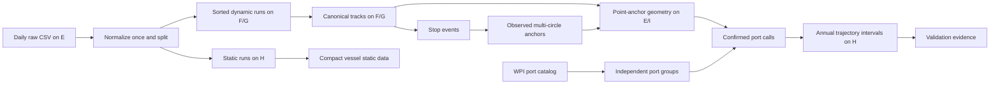

# ExtractAIS v2 processing contract

## Invariants

1. A raw daily CSV is parsed exactly once during ingest.
2. Dynamic and static messages separate immediately after normalization.
3. `track_partition_id = mix(mmsi) & (partition_count - 1)` is stable; one MMSI never crosses partitions.
4. A partition is permanently assigned to one track root and one evidence root.
5. One heavy worker runs per physical track disk. DuckDB thread, memory, and spill limits are explicit.
6. Only an atomically renamed output plus a durable SQLite row is complete.
7. Progress counts committed source bytes; heartbeats report uncommitted internal phases.

## Data flow

## Stage semantics

### Ingest

All source fields are initially read as text. Sentinels become null, timestamps/MMSI/coordinates are typed, and invalid dynamic positions are excluded. The normalized relation is reused to write dynamic lane runs, static runs, and partition statistics. The relation is temporary and never duplicated as a permanent full daily copy.

### Canonical tracks

Each of 1024 tasks reads only the sorted daily runs for its final partition. It performs the archive-wide MMSI/time ordering once, removes exact duplicates, retains same-time coordinate conflicts as evidence, computes sequence/gap/step/implied-speed flags, and writes canonical Parquet. Stop events and latest non-null static vessel attributes are produced inside the same bounded task. After all 1024 outputs are committed, daily ingest runs are deleted.

### Anchors and groups

Stop centroids are aggregated on a spatial grid. Cells require configured stop-event and distinct-vessel support. Qualified cells are matched to nearby WPI members and become observed anchor circles.

WPI ports within `group_distance_km` form connected components. Every member stays in `port_catalog`; the group records all member country/area values and `is_cross_border`. Anchor identity does not contain `port_group_id`, so group rules can change without recalculating point geometry.

### Geometry and calls

A coarse tile join narrows candidates, then Haversine distance determines every point-to-anchor candidate within the approach radius. The complete ranked candidate evidence is retained. Calls map anchor candidates through the current port catalog/groups and require an approach episode with entry evidence and an independently detected stop overlap.

### Intervals

Each point receives its previous and next confirmed call. Classification precedence is:

1. Inside a confirmed call window: `IN_PORT`.
2. Near the previous confirmed group: `DEPARTING`.
3. Near the next confirmed group: `ARRIVING`.
4. Otherwise: `OCEAN`.

Observation gaps above `unknown_gap_hours` are explicit `UNKNOWN_GAP` rows. Consecutive points with equal state/from/to context are compressed into one interval. Cross-year intervals are clipped to annual outputs.

## Dependency invalidation

| Change | Earliest rebuilt stage |
|---|---|
| Raw CSV identity, message types, partition count | `ingest` |
| Deduplication, speed or stop rules | `tracks` |
| Anchor grid/support/assignment | `ports` anchors |
| Entry or approach radius | `geometry` |
| Exit radius | `calls` |
| Port grouping or excluded harbor size | `port_groups`, then calls |
| Call confirmation rules | `calls` |
| Unknown-gap threshold | `intervals` |

Signatures propagate through dependency file identities. Geometry depends on anchors and radii, not port groups; this is the key boundary that makes port-group iteration inexpensive.

## Storage lifecycle

Permanent: canonical tracks, compact vessel static data, stop events, port/anchor catalogs, geometry evidence, port calls, trajectory intervals, validation reports, input inventory, and `state.sqlite`.

Temporary: DuckDB spill directories, heartbeat JSON, `.tmp.parquet`, and ingest sorted runs. Temporary files are scoped to one task. A successful full pipeline removes the temp root; ingest runs are removed only after all tracks validate.

## Validation contract

Before excluding small ports, retain and compare:

- WPI group membership, country/area membership, cross-border flag, and Harbor Size;
- anchor support, vessel support, nearest WPI distance, and unmatched qualified cells;
- every point-to-anchor and point-to-group candidate distance;
- first/second candidate margin and ambiguity flag;
- call entry/exit/stop evidence;
- port and Harbor Size coverage, calling vessels, and ambiguity rates;
- interval state and quality-flag counts.

AIS gaps are not inferred in v2. Long gaps are always `UNKNOWN_GAP`, preserving an auditable base for a separate future inference model.
