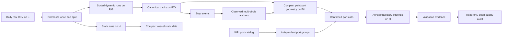

# ExtractAIS v2.3 processing contract

## Invariants

1. A raw daily CSV is parsed exactly once during ingest.
2. Dynamic and static messages separate immediately after normalization.
3. `track_partition_id = mix(mmsi) & (partition_count - 1)` is stable; one MMSI never crosses partitions.
4. A partition is permanently assigned to one track root and one evidence root.
5. One heavy worker runs per physical track disk. DuckDB thread, memory, and spill limits are explicit.
6. Only an atomically renamed output plus a durable SQLite row is complete.
7. Checkpoints and ETA samples count committed source bytes; the visible bar may include conservative internal-phase progress from heartbeats.

## Data flow

## Stage semantics

### Ingest

All source fields are initially read as text. Sentinels become null, timestamps/MMSI/coordinates are typed, and invalid dynamic positions are excluded. The normalized relation is reused to write dynamic lane runs, static runs, and partition statistics. The relation is temporary and never duplicated as a permanent full daily copy.

### Canonical tracks

Each of 1024 tasks reads only the sorted daily runs for its final partition. The task uses five bounded phases: exact deduplication, same-time conflict indexing, MMSI/time sequencing and canonical output, stop-event detection, and static-vessel compaction. Deduplicated points and the conflict index are temporary Parquet files. Every phase uses a fresh DuckDB connection and spill directory, so window-sort memory and native state are released before the next phase. The final schema and task signature are unchanged from v2.0.1. After all 1024 outputs are committed, daily ingest runs are deleted.

### Anchors and groups

Stop centroids are aggregated on a spatial grid. Cells require configured stop-event and distinct-vessel support. Qualified cells are matched to nearby WPI members and become observed anchor circles.

WPI ports within `group_distance_km` form connected components. Every member stays in `port_catalog`; the group records all member country/area values and `is_cross_border`. Anchor identity does not contain `port_group_id`, so group rules can change without recalculating point geometry.

### Geometry and calls

A coarse tile join and Haversine distance first produce compact point-anchor edges in 64 temporary hash shards. Each shard is reduced to the nearest anchor for every `(point, WPI port)` pair, then the raw edge shard is deleted. This reduction is exact for every future port grouping because the minimum over a group equals the minimum of its member-port minima. Calls map the compact WPI-port candidates through the current groups, retain the first and second group distances, and require an approach episode with entry evidence and an independently detected stop overlap. Calls outside the configured years are excluded. A missing second candidate is represented as `has_port_ambiguity=false`, never null.

### Intervals

Each point receives its previous and next confirmed call. Classification precedence is:

1. Inside a confirmed call window: `IN_PORT`.
2. Near the previous confirmed group: `DEPARTING`.
3. Near the next confirmed group: `ARRIVING`.
4. Otherwise: `OCEAN`.

Observation gaps above `unknown_gap_hours` are explicit `UNKNOWN_GAP` rows. Consecutive points with equal state/from/to context are compressed into one interval. Cross-year state continuity is preserved, but point counts, speed statistics, observation-gap statistics and quality flags are re-aggregated from the points inside each configured year before annual outputs are written. Positive-duration gaps are clipped at year boundaries; invalid timestamp years do not enter annual products.

## Dependency invalidation

| Change | Earliest rebuilt stage |
|---|---|
| Raw CSV identity, message types, partition count | `ingest` |
| Deduplication, speed or stop rules | `tracks` |
| Anchor grid/support/assignment | `ports` anchors |
| Entry or approach radius | `geometry` |
| Exit radius | `calls` |
| Port grouping or excluded harbor size | `port_groups`, then calls |
| Call confirmation rules | `calls` |
| Unknown-gap threshold | `intervals` |
| Any audited track/call/interval/validation input | matching `quality_audit` partition |

Signatures propagate through dependency file identities. Geometry depends on anchors and radii, not port groups; this is the key boundary that makes port-group iteration inexpensive.

## Storage lifecycle

Permanent: canonical tracks, compact vessel static data, stop events, port/anchor catalogs, geometry evidence, port calls, trajectory intervals, validation reports, input inventory, and `state.sqlite`.

Temporary: DuckDB spill directories, heartbeat JSON, per-partition deduplicated/conflict Parquet, `.tmp.parquet`, and ingest sorted runs. Temporary files are scoped to one task. A successful full pipeline removes the temp root; ingest runs are removed only after all tracks validate.

## Validation contract

Before excluding small ports, retain and compare:

- WPI group membership, country/area membership, cross-border flag, and Harbor Size;
- anchor support, vessel support, nearest WPI distance, and unmatched qualified cells;
- every point-to-WPI-port nearest-anchor distance and point-to-group candidate distance;
- first/second candidate margin and ambiguity flag;
- call entry/exit/stop evidence;
- port and Harbor Size coverage, calling vessels, and ambiguity rates;
- interval state and quality-flag counts.

AIS gaps are not inferred in v2. Long gaps are always `UNKNOWN_GAP`, preserving an auditable base for a separate future inference model.

## Quality-audit contract

`audit-quality` is intentionally outside `run-all`. It reads completed canonical tracks, validation ambiguity partials, port calls, annual intervals and port groups. Source products are never rewritten. Per-partition summaries are atomically committed under `products/quality_audit/partials`; a global merge produces compact CSV reports and bounded Parquet review samples.

The audit separates four grains that the fast validation reports combine:

1. AIS point and same-second timestamp groups for time conflicts.
2. Ambiguous AIS points assigned back to confirmed port calls.
3. Confirmed calls and their `ARRIVING → IN_PORT → DEPARTING` lifecycle coverage.
4. Compressed state intervals and vessel-year elapsed-time coverage.

Same-second spatial extent is the Haversine diagonal of the coordinate bounding box. It is a separation proxy, not an exact pairwise diameter or mathematical bound. Call ambiguity is reported both as calls containing at least one ambiguous point and as ambiguous points divided by all call points. Unknown gaps are reported as elapsed seconds divided by each vessel-year active span, never as row-count share.

The audit separately reports canonical points whose timestamp year is outside the configured input years. It also reconciles interval-eligible canonical points with the sum of annual interval `ais_point_count`; `interval_point_count_difference` must be zero. Null source ambiguity flags and genuine source/recomputed mismatches are different metrics.

Review evidence is bounded. Each track partition contributes only the strongest call candidates; each selected call contributes at most ten closest-margin points and five points from each temporal boundary. The global sample retains at most 200 calls per review stratum. No port groups are automatically merged by the audit.
